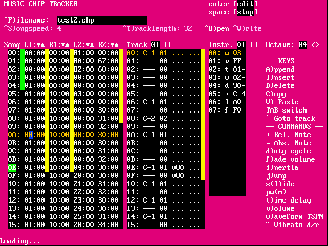

# Chiptracker

Chip tracker for the bitbox, based on  [lft's HArdware Chiptune](http://www.linusakesson.net/hardware/chiptune.php)

## Major changes

Squashed PLAY/EDIT/IDLE modes down into one, because it felt difficult to
move around nimbly. 

TODO:  Add some extra info in song column, to show Track and Transposition columns.

## Original Documentation

Hi!

This is the tracker I used in the hardware chiptune project
(http://www.linusakesson.net/hardware/chiptune.php). It was never intended to
be used by anyone other than me, so it's not exactly user friendly.

This is a quick documentation attempt.

You have to give the tracker a file name when you're starting it. So type
"./tracker test2.song" to start working on the existing song, or type e.g.
"./tracker my_song.song" to start from scratch. Although the GUI hints that you
can later press ^F to change the file name, this was never implemented.

Once you've started the tracker, you'll see that the screen is divided into
three sections: song, track and instrument. Use TAB to move between these
sections. Alternatively, if you're in the song section and the cursor is on a
track identifier, you can press ` (backquote) to start editing this track.

Use { and } to change the current track, and [ and ] to change the current
instrument. Use enter to start playing the current track (in the track section)
or the song (in the song section). Use space to stop playing or to enter edit
mode.

Use < and > to change the current octave. The main part of the keyboard is used
to enter notes. The keyboard layout is adapted for a US qwerty keymap. You can
edit gui.c to change this to fit a Dvorak keymap instead.

Press ^E (control-E) to exit without saving. Press ^W ("write") to save. Press
\# to optimize the song (remove unused tracks, move tracks together) and % to
export the song into a packed format. (% will always export to two files called
"exported.s" and "exported.h" in the current working directory).

In the song and instrument editors, use capital A, I and D to add, insert and
delete lines. In the track and instrument editors, use capital C and V for copy
and paste.

A line in the instrument editor is either a command, a relative note or an
absolute note. Relative notes are indicated by + in the command column,
absolute notes by =. Commands in the instrument editor are the same as commands
in the track editor.

The available commands are:

	dxx Set duty cycle (pulse width) to xx.
	fxx Set volume fade speed to xx. So, fff is a slow fadeout, f01 is a slow fadein.
	ixx Set channel inertia. A high inertia causes automatic slides between notes. Default 0.
	jxx Jump to instrument line xx. Used to create arpeggio loops.
		Warning: The loop must contain a delay element (t command), otherwise you'll crash the software.
	lxx Set sLide. So, lff is a slow slide down, l01 is a slow slide up.
	mxx Set pulse width modulation rate to xx.
	txx Wait xx time units.
	vxx Set channel volume to xx.
	wxx Set waveform. 00 = triangle, 01 = saw, 02 = pulse, 03 = noise.
	~xy Set vibrato. x = depth, y = rate.

Investigate test2.song, and play around, and you'll probably get the hang of
things! Remember that the packed format only supports one command per track
line (see homepage).

Good luck!

Linus (lft^kryo)
